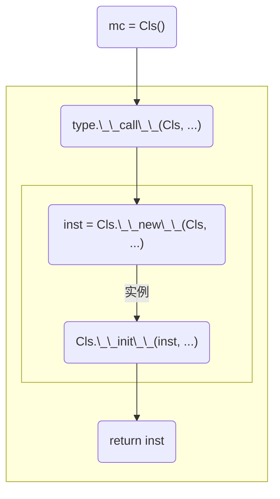

# 元类

## 元类是什么

Python中的类本身，也是某个类型的实例，这个类型就叫做元类。普通类是元类的实例，元类是普通类的工厂。

普通类实例化的时机，是我们的代码执行到某一行代码的时候，以一个类似于函数调用的语法进行实例化，比如 `mc = Cls()` 。

而普通类作为元类的实例，其也是有被实例化的时候，这个过程就发生在代码进入解释器后，类定义部分的代码刚刚执行完。说白了，
`class` 关键字表示的代码块，是一个函数，这个函数定义完就会被立刻执行，然后产生一个类实例。

```python
class DefinitionIsExecution():
    print("This class like function is executed")
# This class like function is executed
```

普通的类如果不特别指定元类，那么其元类就是 `type` ； `type` 本身也是个类型，神奇的是 `type` 的元类也是 `type` 。

```python
type(object) # <class 'type'>
type(type) # <class 'type'>
```

## 元类有什么用

普通类通过重载诸如 `__getitem__` 、 `__getattr__` 之类的“魔法方法”可是重载运算符或命令，
但是这也仅限于做语法教我们做的事情。有了元类我们可以做一些语法没教我们的事情，
比如控制类的实例化过程、单例类、工厂模式等。

## 元类长什么样

手动定义元类，一般手动定义一个 `__new__` ， `__init__` ， `__call__` 就够用了。暂时难以理解也没关系，先有个印象，
我们后续了解完类的实例化过程再回过头就能看懂了。

```python
class MetaClass(type):

    def __new__(cls, name, bases, meta):
        return super().__new__(cls, name, bases, meta)

    def __init__(self, name, bases, meta):
        super().__init__(name, bases, meta)

    def __call__(self, *args, **kwargs):
        return super().__call__(*args, **kwargs)
```

`__new__` 和 `__init__` ：控制着元类的实例化过程和初始化过程，我们可以在这两个过程中给普通类“夹带私货”，
可以实现单例类、工厂类、常量类等功能。

* `__new__` 的 `cls` ：元类。
* `__init__` 的 `self` ：普通类（注意不是普通类的实例）。
* `name` ：普通类的名称。
* `bases` ：普通类的基类元组。
* `meta` ：普通类的元数据字典，可以似理解为普通类的方法、类变量等。

`__call__` ：控制着普通类以函数调用形式实例化的行为，就是因为有了它，
自定义的类才可以通过 `mc = Cls()` 这种形式实例化。

* `self` ：普通类（注意不是普通类的实例）。
* `*args` 和 `**kwargs` ：普通类实例化的参数列表，因为元类一般无法确定普通类实例化的参数列表的名称和数量，
所以多数情况下将参数列表原样交给 `type.__call__` 来处理，
也就是通过 `type.__call__` 调用普通类自己的构造函数来处理参数列表。

## 普通类的实例化过程

我们先来看看Python中普通类实例化的过程，它是一条流水线。



1. 当我们执行 `mc = Cls()` 的时候，由于是对普通类以函数调用的形式实例化，
所以会触发元类的 `__call__` 方法。在元类的 `__call__` 方法中，将操作层层转发给了元类的父类，
也就是 `type` 默认的 `__call__` 方法。
2. `type.__call__` 会负责调用普通类的 `__new__` 方法，进而向解释器申请内存，真正开始实例化的工作，
操作结束后将刚刚产生的实例返回。
3. 刚刚普通类的 `__new__` 方法返回的实例会被带入普通类的 `__init__` 方法，进行一些初始化。
4. 最后 `type.__call__` 将刚刚普通类 `__new__` 产生的实例返回。

用伪代码来表示大致如下。

```python
class type:
    ...
    def __call__(cls, *args, **kwargs):
        inst = cls.__new__(cls, *args, **kwargs)
        cls.__init__(inst, *args, **kwargs)
        return inst
```

利用这个知识点，我们能够写出一个万能的普通类实例化函数。

```python
class Cls:
    def __init__(self):
        print("Cls is instantiated")

def instantiate(cls, *args, **kwargs):
    inst = type.__call__(cls, *args, **kwargs)
    return inst

inst = instantiate(Cls) # Cls is instantiated
```

---

# 元类的使用案例

## 通过元类实现不可实例化类

有时候会希望禁止类被错误实例化，比如某个类，定义的是一堆枚举值，没有必要实例化。我们在元类的 `__call__` 内报错，
这样一旦普通类企图通过函数调用的形式 `mc = Cls()` 实例化就会报错了。

```python
class NotInstantiable(type):

    class NotInstantiableError(Exception):...

    def __call__(self, *args, **kwargs):
        raise self.__class__.NotInstantiableError(
            f"Class {self.__name__} is not instantiable"
        )

if __name__ == "__main__":
    class Cls(metaclass=NotInstantiable):
        ...
    mc = Cls()
    # __main__.NotInstantiable.NotInstantiableError: Class Cls is not instantiable
```

## 通过元类实现常量类

Python中的变量名只是个标签贴在数据上，所以很不幸的现实就是无法做到对某个变量名只读。
但是可以用一个普通类作为容器保存数据，在元类中限制普通类属性的读写操作。

```python
import os

class ConstMeta(type):

    class ConstError(Exception):...

    class NotInstantiableError(Exception):...

    def __setattr__(self, key ,value):
        """
        拦截已有数据的二次覆盖。
        """
        if key in self.__dict__:
            raise self.__class__.ConstError(
                "Const value can't be overridden")
        super().__setattr__(key, value)

    def __getitem__(self, key):
        """
        实现类似字典通过键访问值的操作。
        """
        return self.__dict__[key]

    def __call__(self, *args, **kwargs):
        """
        禁止实例化。
        """
        raise self.__class__.NotInstantiableError(
            "Const type can't be instantiated")

    def __repr__(self):
        prefix = "< {} >".format(
            " ConstType: {} "
            .format(self.__name__)
            .center(os.get_terminal_size()[0] - 4, "-")
            )
        return prefix + "\n".join(list(map(
            lambda item: str(item),
            filter(lambda item: (not item[0].startswith("__")),
                   self.__dict__.items()))))

if __name__ == "__main__":
    from collections import namedtuple

    class Globals(metaclass=ConstMeta):

        PLATFORM_WINDOWS = "windows"
        PLATFORM_LINUX   = "linux"
        PLATFORM_OSX     = "osx"
        PLATFORM_UNIX    = "unix"
        PLATFORM = PLATFORM_WINDOWS
        VERSION = namedtuple("Version",
             ("major", "minor", "micro", "tag", "extra"),
             defaults=(1, 0, 0, "release", ""),
             )()

    print(Globals)
    # < --------------------- ConstType: Globals --------------------- >
    # ('PLATFORM_WINDOWS', 'windows')
    # ('PLATFORM_LINUX', 'linux')
    # ('PLATFORM_OSX', 'osx')
    # ('PLATFORM_UNIX', 'unix')
    # ('PLATFORM', 'windows')
    # ('VERSION', Version(major=1, minor=0, micro=0, tag='release', extra=''))
    print(Globals.VERSION)
    # Version(major=1, minor=0, micro=0, tag='release', extra='')
    print(Globals["VERSION"])
    # Version(major=1, minor=0, micro=0, tag='release', extra='')
    Globals["VERSION"] = (1, 2, 3)
    # TypeError: 'ConstMeta' object does not support item assignment
```

当然，这个常量类也有其自己的局限，它可以阻止自己的字段被替换为其他对象，
但无法阻止自己的可变数据被修改（这个问题在C++中同样存在，就像是在C++中 `int * const ptr` 可以限制指针不能到处乱指，
但是无法限制指向的数据发生变化）。

除了元类，常量类也还有很多其他途径可以实现，希望读者不要被限制了想象力。

## 通过元类实现单例类

想要通过元类实现单例，关键点在于留存一个普通类的实例，这个实例我们可以保存为元类的成员。
另外，为了防止多次实例化、多次初始化，还可以对普通类函数调用式的实例化方式 `mc = Cls()` 进行拦截。

```python
class Singleton(type):

    def __new__(cls, name, bases, meta):
        meta["__call__"] = lambda self: self
        return super().__new__(cls, name, bases, meta)

    def __call__(self, *args, **kwargs):
        """
        确保在第二次调用时不会再次实例化实例，而是直接返回先前产生的实例。
        """
        if not hasattr(self, "instance"):
            self.instance = super().__call__(*args, **kwargs)
        # 拦截试图二次实例化的行为，不拦截也是没有问题的
        # else:
        #     raise RuntimeError("Singleton instantiated twice")
        return self.instance

if __name__ == "__main__":
    class Cls(metaclass=Singleton):...
    print(Cls() is Cls()) # True
    print(Cls() is Cls.instance) # True
    print(Cls() is Cls.instance()) # True，得益于meta中塞了一个__call__
```

常见的错误做法是，在普通类的 `__new__` 方法中总返回先前产生的实例，但是如果复习一下普通类的实例化过程就会发现，
虽然 `__new__` 方法没有再次产生新的实例，但是其返回的实例每次都会被再次送入 `__init__` 再次进行初始化。
为了解决这个问题，只需要在元类中从 `__call__` 方法直接返回实例，不经由普通类的 `__new__` 方法，
那么实例就不会被再次送入普通类的 `__new__` 方法。

```python
# 错误做法
class Cls:

    def __new__(cls, *args, **kwargs):
        if not hasattr(cls, "instance"):
            cls.instance = super().__new__(cls, *args, **kwargs)
            print("Singleton new")
        return cls.instance

    def __init__(self, *args, **kwargs):
        print("Singleton init")

if __name__ == "__main__":
    print(Cls() is Cls()) # True
    # Singleton new
    # Singleton init
    # Singleton init
```

## 通过元类实现定义即实例化的单例

前面我们说过，普通类是元类的实例。为了让某个单例类在定义的时候就被实例化，而不用程序员手动实例化，
我们只需要在元类的 `__init__` 方法中，在普通类产生后立即对普通类实例化即可。

```python
"""
我们可以复用上个例子中的Singleton类。
"""
class SingletonWithInstance(Singleton):

    def __init__(self, name, bases, meta):
        super().__init__(name, bases, meta)
        self.instance = super().__call__()
```

## 通过元类实现工厂类

在元类中从 `__call__` 拦截普通类直接实例化，然后再元类中给普通类强塞一个工厂方法作为普通类的类方法即可实现工厂类。

```python
class Factory(type):

    class NotDirectlyInstantiableError(Exception):...

    def __init__(self, name, bases, meta):
        """
        将元类的__create方法塞入普通类作为类方法。
        """
        if "create" in meta:
            raise AttributeError(
                f"Class {self.__name__} should not implement method "
                f"named 'create', it's a magic method for create"
            )
        self.create = classmethod(self.__class__.__create)

    def __call__(self, *args, **kwargs):
        """
        拦截函数调用式的实例化方式。
        """
        raise self.__class__.NotDirectlyInstantiableError(
            f"Class {self.__name__} is not directly instantiable, "
            f"please use {self.__name__}.create to instantiate"
        )

    def __create(cls, *args, **kwargs):
        instance = cls.__new__(cls, *args, **kwargs)
        instance.__init__(*args, **kwargs)
        return instance

if __name__ == "__main__":
    class Cls(metaclass=Factory):

        def __init__(self, arg1, arg2, arg3):
           print(f"Cls is instantiated: {arg1} {arg2} {arg3}")

    mc = Cls.create(1, 2, 3)
```

还有一种取巧的方式实现工厂类。我们前面说过，我们前面在伪代码中提到，普通类 `__new__` 方法产生的实例，
是被元类的 `__call__` 方法送入普通类的 `__init__` 方法的。
所以我们只要不让普通类的实例化经过元类的 `__call__` 方法即可。我们手动来调用普通类的 `__new__` ，
然后走我们自己的初始化函数；并且在普通类的 `__init__` 方法中报错，阻止常规的实例化。

```python
class Info:

    def __new__(cls, *args, **kwargs):
        res = super().__new__(cls)
        res.__init(*args, **kwargs)
        return res

    def __init__(self):
        raise Exception("Can't instantiate")

    def __init(self, name, age):
        self.name = name
        self.age = age

    def __repr__(self):
        return f"< Info name:{self.name} age:{self.age} >"

def create_info(name, age):
    instance = Info.__new__(Info, name, age)
    return instance

man = create_info("Guido", 70)
man = Info("Guido", 70) # Error
```

## 元类冲突

有时候在自己的代码中继承了第三方库的某个类，希望将其变成单例，此时不出意外的话你会收到一个元类冲突的报错。

```python
from PySide2.QtWidgets import *
from PySide2.QtCore import *
from PySide2.QtGui import *

class Singleton(type):

    def __new__(cls, name, bases, meta):
        meta["__call__"] = lambda self: self
        return super().__new__(cls, name, bases, meta)

    def __call__(self, *args, **kwargs):
        if not hasattr(self, "instance"):
            self.instance = super().__call__(*args, **kwargs)
            self.instance.__call__ = lambda: self.instance
        return self.instance

if __name__ == "__main__":
    class Cls(QWidget, metaclass=Singleton):
        ...
    # TypeError: metaclass conflict: the metaclass of a derived class
    # must be a (non-strict) subclass of the metaclasses of all its bases
```

因为元类不同于基类，基类可以存在多个，也就是多继承，但是元类只能有一个。就好比孩子会有父母的基因，
但是生孩子的只能是母亲一人。为了解决这个问题，可以再定义一个元类，让它同时继承自两个不同的元类。

```python
from PySide2.QtWidgets import *
from PySide2.QtCore import *
from PySide2.QtGui import *

class Singleton(type):

    def __new__(cls, name, bases, meta):
        meta["__call__"] = lambda self: self
        return super().__new__(cls, name, bases, meta)

    def __call__(self, *args, **kwargs):
        if not hasattr(self, "instance"):
            self.instance = super().__call__(*args, **kwargs)
            self.instance.__call__ = lambda: self.instance
        return self.instance

class QtSingleton(type(QObject), Singleton):...

if __name__ == "__main__":
    class Cls(QWidget, metaclass=QtSingleton):
        ...
    app = QApplication([])
    print(Cls() is Cls()) # True
    print(Cls() is Cls.instance) # True
    print(Cls() is Cls.instance()) # True
```
