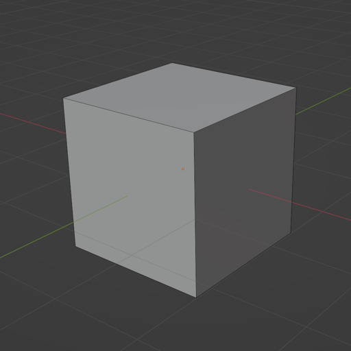
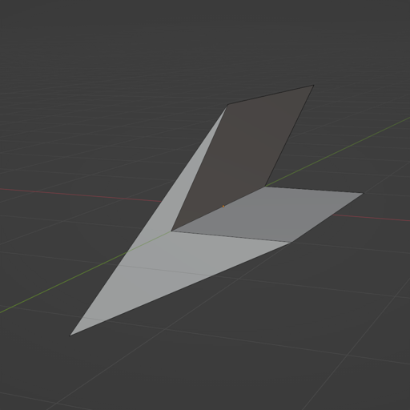
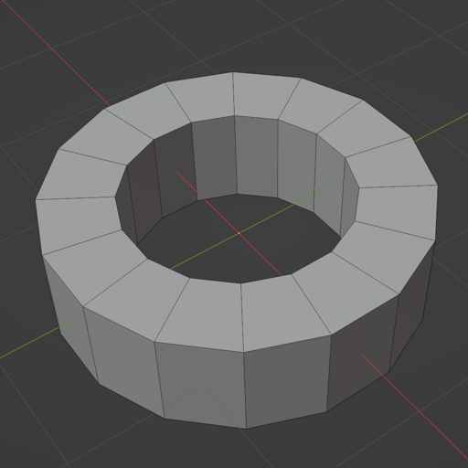
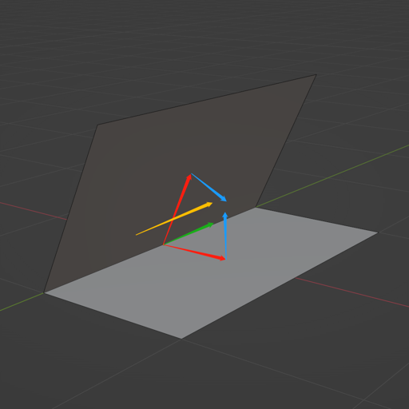
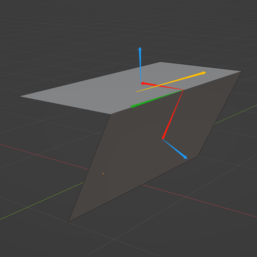
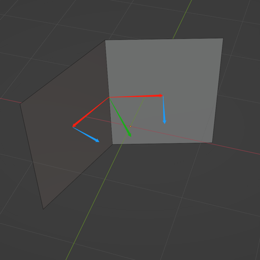
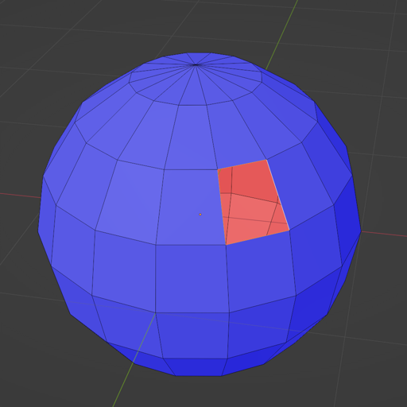
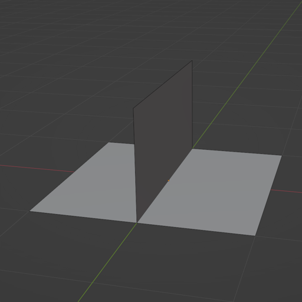

# 如何检测Polygon是不是一个Convex Hull

> 通常情况下，一个Convex Hull的相邻面法线一定不会是面对面的状况，所以dot(n1, n2) < 0是一定的。但是不能由dot(n1, n2) < 0就得到两个相邻面一定背对背，因为面对面的情况下同样符合该特征。这样来看，Convex Hull的检测也是个看似简单实则有点棘手的问题。
> 
> 
> 
> 根据邻面法线点乘的正负，可以确定两个面的夹角状况，可以分为三种状况：
> 
> > __dot(n1, n2)==0__ ：直角，一定符合
> > 
> > 
> > 
> > __dot(n1, n2)<0__ ：锐角，两个邻面可能面对面，也可能背对背，未必符合
> > 
> > 
> > 
> > __dot(n1, n2)>0__ ：钝角，两个邻面可能面对面，也可能背对背，未必符合
> > 
> > 

# 锐角：

> 我们用蓝色表示面法线。
> 
> 从边的中点向面的中点作一条向量，暂且称其为 __中线__ ，用红色表示。
> 
> 对中线叉乘，得到结果用绿色表示。
> 
> 对法线叉乘，得到结果用黄色表示。
> 
> 根据点乘结果可知，凹陷时黄线和绿线同向，凸起时黄线和绿线异向。
> 
> 
> 
> 

# 钝角

> 我们用蓝色表示面法线。
> 
> 从边的中点向面的中点作一条向量，暂且称其为 **中线** ，用红色表示。
> 
> 两条法线的平均值作为边法线，用绿色表示。
> 
> 用边法线和其中一个面法线点乘。
> 
> 根据点乘结果可知，凹陷时面法线和边法线异向，凸起时面法线和边法线同向。
> 
> 
> 
> 

# 破洞

> 还有一种状况，可以直接认为不是Convex Hull，即模型破洞。
> 
> 如何鉴别呢，破洞的边缘，每一条边只有一个面与之相连。
> 
> 

# 非流形

> 非流形通常是模型制作人员错误操作留下的不合法模型，也不是Convex Hull。
> 
> 典型的状况就是T型面，即一个边被三个面共享。
> 
> 
